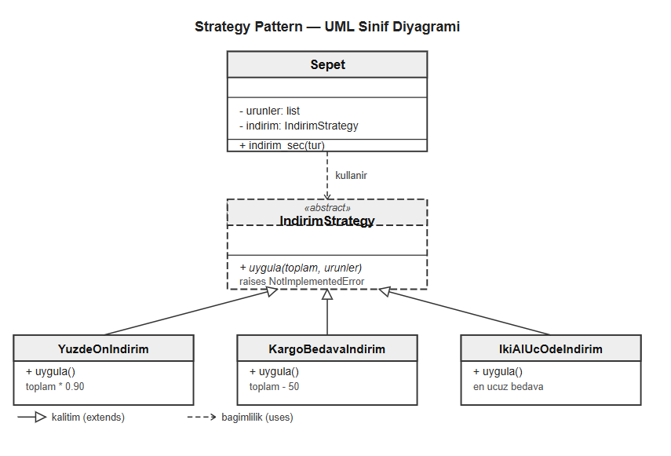

# E-Ticaret Sepeti — Tasarım Örüntüleri Ödevi

Bu proje, yazılım tasarım örüntülerini gerçek bir e-ticaret sepeti
üzerinde uygulamak amacıyla geliştirilmiştir. Her faz yeni bir
örüntü katmanı ekleyerek sistemi daha esnek ve genişletilebilir hale getirir.

## Nasıl Çalıştırılır

Python 3 kurulu olmalıdır.

    python src/servis.py

## Kullanılan Tasarım Örüntüleri

### Creational (Oluşturucu)

Factory Pattern — src/indirimler.py
İndirim nesnesi oluşturma sorumluluğu IndirimFactory sınıfına verildi.
String yerine nesne döndürür, hatalı girişte ValueError fırlatır.

### Structural (Yapısal)

Strategy Pattern — src/indirimler.py
Her indirim türü ayrı bir sınıfa taşındı. Yeni indirim eklemek için
mevcut koda dokunmak gerekmiyor.

Decorator Pattern — src/dekoratorler.py
Sepete hediye paketi ve ekspres kargo özelliği eklendi. Mevcut Sepet
sınıfı değiştirilmedi, özellikler sarmalama yöntemiyle eklendi.

Facade Pattern — src/servis.py
SepetServisi sınıfı tüm alt sistemi tek bir arayüzden yönetiyor.
Kullanıcı iç karmaşıklığı bilmek zorunda değil.

### Behavioral (Davranışsal)

Observer Pattern — src/gozlemciler.py
Sepette olay olduğunda StokServisi, BildirimServisi ve LogServisi
otomatik haberdar oluyor. Yeni servis eklemek için mevcut koda
dokunmak gerekmiyor.

Command Pattern — src/komutlar.py
Her işlem bir komut nesnesine dönüştürüldü. KomutYoneticisi geçmişi
tutarak geri alma özelliği sağlıyor.

## Mimari Diyagram

Tüm UML diyagramları docs/diagrams/ klasöründe bulunmaktadır:
- faz1-strategy-uml.png — Strategy Pattern
- faz1-factory-uml.png — Factory Pattern
- docs/diagram/decorator.png — Decorator Pattern
- docs/diagram/facade.png — Facade Pattern
- faz3-observer-uml.png — Observer Pattern
- faz3-command-uml.png — Command Pattern

## Proje Yapısı

    eticaret-sepeti/
    ├── src/
    │   ├── sepet.py         → Temel sepet sınıfı
    │   ├── indirimler.py    → Strategy + Factory
    │   ├── dekoratorler.py  → Decorator Pattern
    │   ├── servis.py        → Facade Pattern
    │   ├── gozlemciler.py   → Observer Pattern
    │   └── komutlar.py      → Command Pattern
    ├── docs/
    │   ├── diagrams/        → UML diyagramları
    │   └── ai-log/          → AI kullanım günlükleri
    ├── PATTERNS.md          → Örüntü açıklamaları
    └── PROBLEMS.md          → Başlangıç kodu sorunları